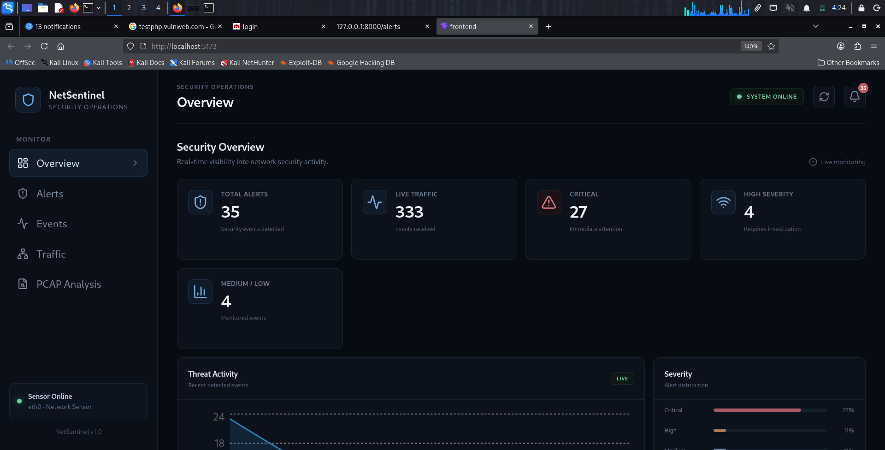
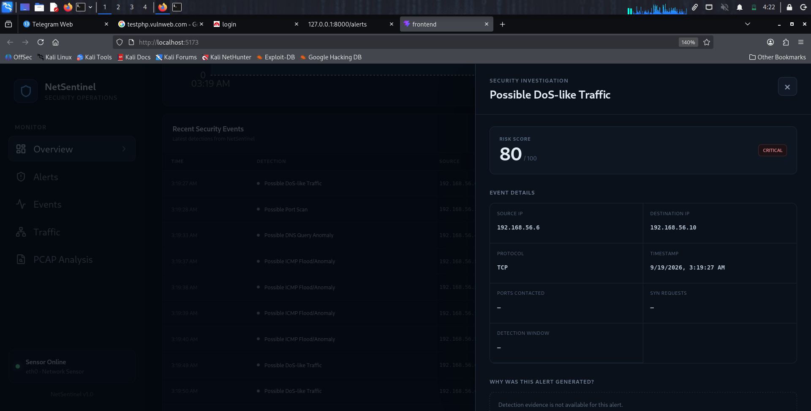
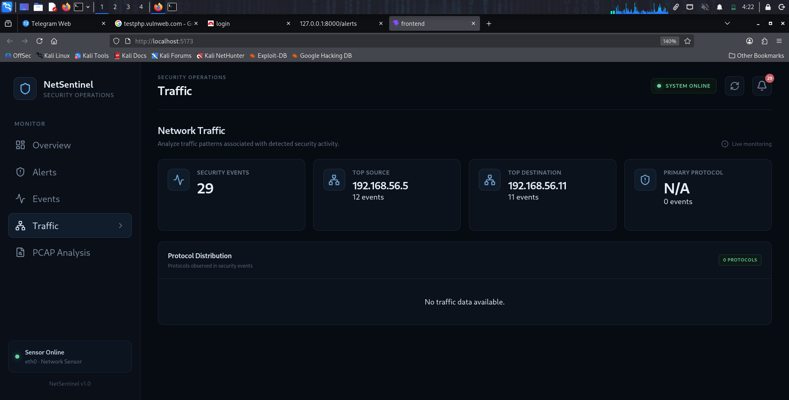
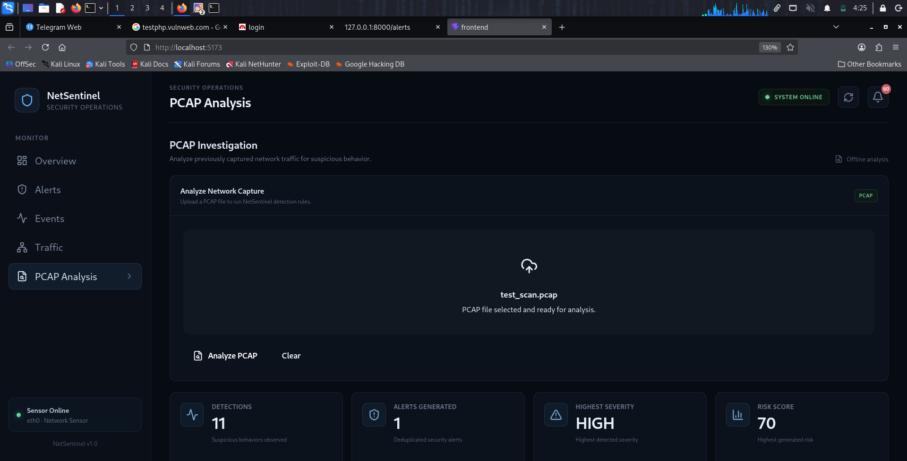

# 🛡️ NetSentinel

### Lightweight Network Threat Detection & Investigation Tool

NetSentinel is a lightweight cybersecurity tool that monitors and analyzes network traffic to identify suspicious behavior and generate explainable security alerts.

Instead of simply reporting an attack, NetSentinel provides investigation context such as the source and destination involved, observed network behavior, detection evidence, risk score, severity, and investigation timeline.

The project focuses on practical **network security monitoring, packet analysis, detection engineering, alerting, and SOC-style investigation**.

---

## 🖥️ NetSentinel Console

### Security Overview

The Overview dashboard provides a centralized view of detected security activity, alert severity, recent threat activity, and network monitoring status.



### 🚨 Security Alerts & Investigation

Analysts can review generated alerts and open an individual alert to investigate its detection evidence, network details, risk score, severity, and investigation timeline.



### 🌐 Network Traffic Monitoring

The Traffic section provides visibility into monitored network events, communication endpoints, and protocol activity.



### 📦 PCAP Analysis

NetSentinel can analyze previously captured network traffic through PCAP files, allowing suspicious activity to be investigated without relying only on live traffic.



---
# 🔍 How NetSentinel Works

NetSentinel follows a detection and investigation pipeline that converts network activity into explainable security alerts.

```text
Network Traffic
      │
      ▼
Packet / Event Parsing
      │
      ▼
Feature Extraction
      │
      ▼
Detection Engine
      │
      ├── Port Scan Detection
      ├── ICMP Anomaly Detection
      ├── DNS Anomaly Detection
      └── DoS-like Traffic Detection
      │
      ▼
Risk Engine
      │
      ├── Risk Score
      └── Severity
      │
      ▼
Alert Pipeline
      │
      ▼
Alert Deduplication
      │
      ▼
Security Alert
      │
      ▼
NetSentinel Dashboard
      │
      ▼
Investigation
```

---

# 🚨 Detection Capabilities

## Port Scan Detection

NetSentinel identifies suspicious port scanning behavior by analyzing communication across multiple destination ports and TCP connection characteristics within a defined observation window.

## ICMP Anomaly Detection

The ICMP detector monitors ICMP traffic over a configured time window and identifies activity that exceeds the configured packet threshold.

## DNS Query Anomaly Detection

The DNS detector monitors DNS query activity within a defined observation window and identifies unusually high query activity.

## DoS-like Traffic Detection

The DoS detector monitors packet volume over a defined time window and identifies traffic that exceeds the configured threshold.

---

# 📊 Risk & Alert Processing

After a detection is generated, NetSentinel passes the event through its risk engine.

The risk engine produces:

- Risk score from 0–100
- Severity classification
- Detection context

Current detection-specific severity handling includes:

| Detection | Severity |
|---|---|
| Possible Port Scan | HIGH |
| Possible ICMP Flood/Anomaly | CRITICAL |
| Possible DNS Query Anomaly | MEDIUM |
| Possible DoS-like Traffic | CRITICAL |

Repeated detections are handled through an alert deduplication mechanism to reduce unnecessary duplicate alerts.

---

# 🔎 Security Investigation

Opening an alert provides additional context for understanding why the detection was generated.

The investigation view can include:

- Source IP
- Destination IP
- Protocol
- Timestamp
- Ports contacted
- SYN requests
- Packet count
- Detection window
- Risk score
- Severity
- Detection evidence
- Investigation timeline

This makes the alert more useful for investigation than a simple **"Attack Detected"** message.

---
## 🧰 Technical Stack

### Backend

- **Python** — core application and detection logic
- **FastAPI** — backend API and traffic/event endpoints
- **Scapy** — packet capture and network packet analysis

### Frontend

- **React** — NetSentinel security dashboard
- **Vite** — frontend development environment
- **Recharts** — traffic and security data visualization
- **Lucide React** — interface icons

### Security Analysis

- **PCAP** — offline network traffic investigation
- **Nmap** — controlled network scanning for detection testing
- **Metasploitable** — isolated lab target for live detection testing

## 📁 Project Structure

```text
NetSentinel/
├── api.py
├── capture.py
├── parser.py
├── features.py
├── detection_engine.py
├── risk_engine.py
├── alert_schema.py
├── alert_manager.py
├── alert_deduplicator.py
├── alert_pipeline.py
├── pcap_analyzer.py
├── traffic_manager.py
│
├── traffic_generator/
│   ├── generate_dataset.py
│   └── replay_dataset.py
│
├── frontend/
├── docs/
│   └── screenshots/
├── requirements.txt
├── .gitignore
└── README.md
```

## ⚡ Quick Start

### 1. Clone the Repository

```bash
git clone https://github.com/yadavchirag957-droid/NetSentinel.git
cd NetSentinel
```

### 2. Create the Python Environment

```bash
python3 -m venv .venv
source .venv/bin/activate
```

### 3. Install Dependencies

```bash
pip install -r requirements.txt
```

### 4. Start the NetSentinel Backend

```bash
uvicorn api:app --host 0.0.0.0 --port 8000
```

### 5. Start the Frontend

Open another terminal:

```bash
cd ~/netsentinel/frontend
npm install
npm run dev
```

## 🧪 Live Network Detection

NetSentinel can monitor live network traffic and detect suspicious behavior generated in a controlled lab environment.

### Live Detection Flow

```text
Metasploitable
      ↓
Nmap Scan
      ↓
Network Traffic
      ↓
NetSentinel capture.py
      ↓
Packet Parsing
      ↓
Feature Extraction
      ↓
Detection Engine
      ↓
Risk Assessment
      ↓
Security Alert
      ↓
NetSentinel Dashboard
```

### Start Live Capture

From the NetSentinel project root:

```bash
sudo python capture.py
```

In the controlled lab, network activity such as an Nmap scan against the Metasploitable machine can then be observed and analyzed by NetSentinel.

## 📊 Dataset Replay

NetSentinel also supports controlled traffic replay for testing multiple detection scenarios without depending only on live network activity.

### Replay Flow

```text
Traffic Dataset
      ↓
replay_dataset.py
      ↓
NetSentinel API
      ↓
Feature Extraction
      ↓
Detection Engine
      ↓
Risk Assessment
      ↓
Security Alerts
      ↓
Dashboard
```

### Replay the Dataset

From the NetSentinel project root:

```bash
python traffic_generator/replay_dataset.py
```

## 🧪 Example Detection Flow

A typical port scan investigation can be demonstrated as:

```text
Nmap / Suspicious Network Activity
              │
              ▼
       Network Traffic
              │
              ▼
       Feature Extraction
              │
              ▼
       Detection Engine
              │
              ▼
      Possible Port Scan
              │
              ▼
        Risk Assessment
              │
              ▼
       Security Alert
              │
              ▼
     Investigation Panel
```

The investigation panel provides contextual information about the activity that triggered the alert.

## 🎯 Project Objective

The objective of NetSentinel is to move beyond simply observing network packets and demonstrate how network behavior can be analyzed to identify activity that may require security investigation.

The project combines:

```text
Networking
     +
Packet Analysis
     +
Detection Engineering
     +
Risk Assessment
     +
Alert Management
     +
Security Investigation
```

## ⚠️ Current Scope & Limitations

NetSentinel is a learning and portfolio project designed to demonstrate practical cybersecurity concepts.

It is **not a production replacement for an enterprise SIEM, IDS/IPS, or complete SOC platform**.

Current limitations include:

- Detection rules are primarily threshold and behavior based.
- Detection thresholds are statically configured.
- Advanced machine-learning detection is outside the current scope.
- Enterprise-scale distributed monitoring is outside the current scope.
- The current system focuses on network-level detection and investigation.

## 🚀 Future Improvements

Potential future improvements include:

- Additional network detection rules
- Improved false-positive handling
- MITRE ATT&CK mapping
- Sigma-based detection support
- Threat intelligence integration
- Persistent event storage
- More advanced PCAP investigation
- Authentication and analyst roles
- Expanded investigation workflows
- Additional protocol-specific detections

## 👨‍💻 Author

**Chirag Yadav**

Cybersecurity project focused on network monitoring, threat detection, detection engineering, and security investigation.

